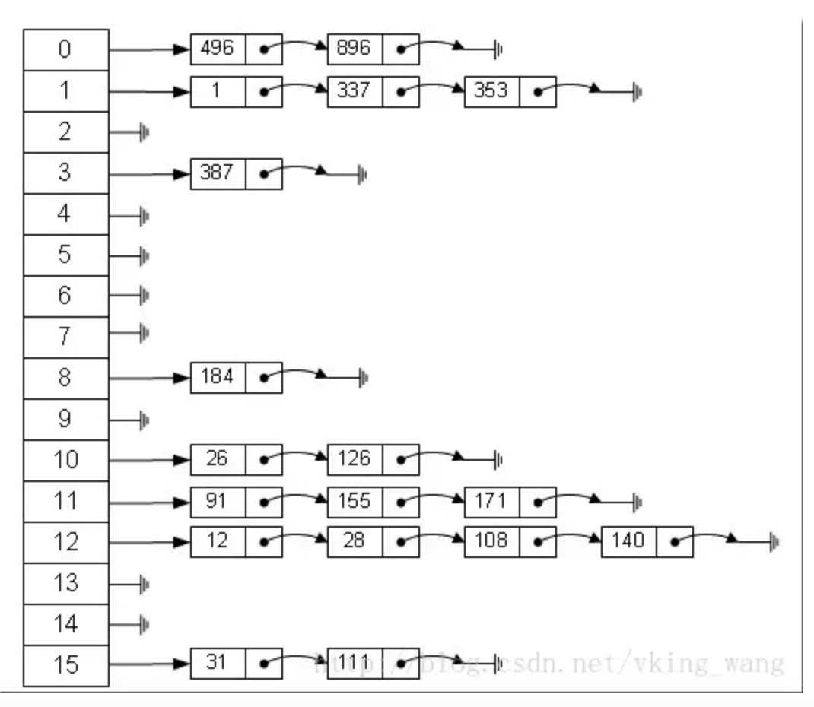

# 数据结构和算法
`程序` = `数据结构` + `算法`

## 练习题

1. [LeetCode project](/LeetCode/README.md)中包含了 [LeetCode](https://leetcode-cn.com/) 上题目的解题思路和代码。

2. [剑指Offer project](剑指Offer/README.md) 中包含了 《剑指Offer》上题目的实现代码 in Swfit。

## 数据结构

### 1. 数组和链表

数组与链表不同操作造成的时间复杂度：

| 操作 | 数组 | 链表 |
| ---- | ---- | ---- |
| 查找 | O(1) | O(n) |
| 插入 | O(n) | O(1) |
| 删除 | O(n) | O(1) |

**数组**，在内存中是一段连续的内存地址，可以通过下标偏移就可找到对应元素，所以时间负载度O(1)。但是在面对插入或者删除时，会造成七天元素移动来填满这段连续内存地址，所以时间复杂度是O(n)。

**链表**，在内存中是分散的内存地址。

### 2. Hash表

哈希表（Hash Table，也叫散列表），是根据关键码值 (Key-Value) 而直接进行访问的数据结构。也就是说，它通过把关键码值映射到表中一个位置来访问记录，以加快查找的速度。哈希表的实现主要需要解决两个问题，哈希函数和冲突解决。

#### 哈希函数

哈希表的关键思想是使用哈希函数`将键映射到存储桶`。更确切地说，

1. 当我们插入一个新的键时，哈希函数将决定该键应该分配到哪个桶中，并将该键存储在相应的桶中；
2. 当我们想要搜索一个键时，哈希表将使用相同的哈希函数来查找对应的桶，并只在特定的桶中进行搜索。

> 比如：对key的值进行hash后对数组长度%，这就是一个哈希函数。

#### 冲突解决 

在方法冲突时有多种方式来解决冲突，开放定址法，链地址法，建立公共溢出区等。实际的哈希表实现中，使用最多的是链地址法：

> 链地址法：其实就是 `数组 + 链表` 的结构。



### 3. 队列

一种FIFO先进先出的数据结构。以数组作为底层数据结构的语言中，通常`队列`都是通过`循环数组`来实现。使用`循环数组`比普通`数组`更加高效、节约空间。  
[题目：使用循环数组实现队列]()  
[使用循环数组实现队列思路](https://leetcode-cn.com/explore/featured/card/queue-stack/216/queue-first-in-first-out-data-structure/865/)  

#### 广度优先搜索(BFS)

`广度优先搜索`（BFS）是一种`遍历或搜索`数据结构（如树或图）的算法。主要运用常见在`遍历`或`找出最短路径`。
[使用BFS查找最短路径]()

#### 深度优先(DFS)

`深度优先搜索`优先遍历节点深度。多用递归的方式，但是考虑到递归的局限性，通常也会考虑非递归的实现方式。

#### 剪枝

剪枝策略，属于算法优化范畴；通常应用在DFS 和 BFS 搜索算法中。剪枝策略就是寻找过滤条件，提前减少不必要的搜索路径。

### 4. 栈


### 5. 图

* BFS

* DFS

### 6. 树

树是图的一种特殊退化形式。

#### 树的遍历

* 深度优先遍历
1. 先序遍历
```c
void pre_order_traversal(TreeNode *root) {
    // Do Something with root
    if (root->lchild != NULL)
        pre_order_traversal(root->lchild);
    if (root->rchild != NULL)
        pre_order_traversal(root->rchild);
}
```
2. 中序遍历
```c
void in_order_traversal(TreeNode *root) {
    if (root->lchild != NULL)
        in_order_traversal(root->lchild);
    // Do Something with root
    if (root->rchild != NULL)
        in_order_traversal(root->rchild);
}
```
3. 后序遍历
```c
void post_order_traversal(TreeNode *root) {
    if (root->lchild != NULL)
        post_order_traversal(root->lchild);
    if (root->rchild != NULL)
        post_order_traversal(root->rchild);
    // Do Something with root
}
```
每一种遍历都包含递归和非递归两种方式。递归的本质是栈，非递归算法其实就是递归换成栈结构实现。

* 广度优先遍历，从上到下按层来遍历。
  队列实现

#### B树

#### 红黑树


## 算法
### 1. 指针（双指针技巧）

#### 从两端向中间迭代

**同时使用两个指针**进行迭代，使用双指针技巧的典型场景之一是你想要**从两端向中间迭代**数组。这时你可以使用双指针技巧：**一个指针从始端开始，而另一个指针从末端开始**。值得注意的是，这种技巧经常在**排序数组**中使用。

常见场景：

1. 反转数组中的元素  
2. 快速排序变种算法
3. 数据排序  

[344. 反转字符串](#344-反转字符串)  

#### 快慢指针

> 经典题目：给定一个数组和一个值，原地删除该值的所有实例并返回新的长度。考虑空间限制，不重新创建空间。  
> 解决方案：我们使用两个指针：一个仍然用于迭代，而第二个指针总是指向下一次添加删除元素的位置。 

```swift
func removeElement(nums: [Int], val: Int) {
    let k = 0
    for i in 0..<nums.count {
        if nums[i] != val {
            nums[k] = nums[i]
            k += 1
        }
    }
    return k
}
```

[167. 两数之和 II - 输入有序数组](#167-两数之和-ii-输入有序数组)   

#### 滑窗指针

**使用两个指针一前一后遍历**，根据前后指针不同位置，指针闭区间内可以覆盖所有连续组合。  
[209. 长度最小的子数组](209-长度最小的子数组) 

### 2. 排序

好的排序排序算法时间复杂度应该是nlogn，以下是常见的7中排序：

| 名称 | 时间复杂度 | 空间复杂度 | 是否稳定 |
| --- | --- | --- | --- |
| 冒泡排序 | O(n^2) | O(1) | 是 |
| 插入排序 | O(n^2) | O(1) | 是 |
| 选择排序 | O(n^2) | O(1) | 否 |
| 堆排序 | O(nlogn) | O(1) | 否 |
| 归并排序 | O(nlogn) | O(n) | 是 |
| 快速排序 | O(nlogn) | O(logn) | 否 |
| 桶排序 | O(n) | O(k) | 是 |

#### 1. 冒泡排序

常规写法：

```swift
func BubbleSort(array: Array) -> Array {
	for i in 0..<array.count {
  		for j in 1..<array.count - i {
    		if array[j] < array[j-1] {
      			let tmp = array[j-1]
				array[j-1] = array[j]
      			array[j] = tmp
    		}
  		}
	}
    
	return array
}
```


优化:如果已经是有序了就退出循环，判读是否已经有序只用判断是否发生交换。

```swift
func BubbleSort(array: Array) -> Array {
	for i in 0..<array.count {
		var swapped = false
  		for j in 1..<array.count - i {
    		if array[j] < array[j-1] {
      			let tmp = array[j-1]
				array[j-1] = array[j]
      			array[j] = tmp
      			
      			swapped = true
    		}
  		}
  		
  		// 已经是有序了，不在遍历后面
  		if swapped == false {
            break;
  		}
	}
    
	return array
}
```


[鸡尾酒排序](https://zh.wikipedia.org/wiki/%E9%B8%A1%E5%B0%BE%E9%85%92%E6%8E%92%E5%BA%8F)：

```swift
func cocktailSort(array: Array) {
    var left:Int = 0
    var right:Int = arr.count - 1
    var index:Int = 0
    
    while left < right {
        for  i in left..<right {
            if array[i] > array[i + 1] {
                swap(&array[i], &array[i + 1])
                index = i
            }
        }
        
        right = index
        let temp = left + 1
        if temp < right {
            for i in (temp...right).reversed() {
                if array[i] < array[i-1] {
                    swap(&array[i], &array[i-1])
                    index = i
                }
            }
            left = index
        }
    }
}
```

####  2. 插入排序

一般来说，[**插入排序**](https://zh.wikipedia.org/wiki/%E6%8F%92%E5%85%A5%E6%8E%92%E5%BA%8F)都采用in-place在数组上实现。具体算法描述如下：

1. 从第一个元素开始，该元素可以认为已经被排序
2. 取出下一个元素，在已经排序的元素序列中从后向前扫描
3. 如果该元素（已排序）大于新元素，将该元素移到下一位置
4. 重复步骤3，直到找到已排序的元素小于或者等于新元素的位置
5. 将新元素插入到该位置后
6. 重复步骤2~5

```java
public void insertionSort(int[] array) {
		for (int i = 1; i < array.length; i++) {
			int key = array[i];
			int j = i - 1;
			while (j >= 0 && array[j] > key) {
				array[j + 1] = array[j];
				j--;
			}
			array[j + 1] = key;
		}
	}
```


**二分查找插入排序**

>  如果*比较操作*的代价比*交换操作*大的话，可以采用[二分查找法](https://zh.wikipedia.org/wiki/%E4%BA%8C%E5%88%86%E6%9F%A5%E6%89%BE%E6%B3%95)来减少*比较操作*的数目。该算法可以认为是**插入排序**的一个变种

是直接插入排序的一个变种，区别是：在有序区中查找新元素插入位置时，为了减少元素比较次数提高效率，采用二分查找算法进行插入位置的确定。


#### 3. 选择排序

[**选择排序**（Selection sort）](https://zh.wikipedia.org/wiki/%E9%80%89%E6%8B%A9%E6%8E%92%E5%BA%8F)是一种简单直观的[排序算法](https://zh.wikipedia.org/wiki/%E6%8E%92%E5%BA%8F%E7%AE%97%E6%B3%95)。它的工作原理如下。首先在未排序序列中找到最小（大）元素，存放到排序序列的起始位置，然后，再从剩余未排序元素中继续寻找最小（大）元素，然后放到已排序序列的末尾。以此类推，直到所有元素均排序完毕。

优缺点：

1. 原地操作几乎是选择排序的唯一优点，当空间复杂度要求较高时，可以考虑选择排序；

2. 实际适用的场合非常罕见。

```swift
/// - Parameter list: 需要排序的数组
func selectionSort(_ list: inout [Int]) -> Void {
    for j in 0..<list.count - 1 {
        var minIndex = j
        for i in j..<list.count {
            if list[minIndex] > list[i] {
                minIndex = i
            }
        }
        list.swapAt(j, minIndex)
    }
}
```


#### 4. 堆排序

#### 5. 归并排序

#### 6. 快速排序

#### 7. 桶排序

### 3. 斐波那契数列


### 4. 回溯法（递归）

回溯法可以看成是蛮力法的升级版，它从解决问题每一步的所有可能选项里系统地选择出一个可行的解决方案。回溯法非常适合由多个步骤组成的问题，并且每个步骤都有多个选项。当我们再某一步选择了其中一个选项时，就进入下一步，然后又面临新的选择。我们就这样重复选择，知道达到最终的状态。

相关题目有：

* 矩阵中的路径
* 机器人的运动范围

解决方案： 

* 递归

> 递归本质是栈，也可以用栈的结构替换递归方案。

* 创建visited数组，保存访问过的节点。


### 5. 动态规划与贪婪算法

#### 动态规划

使用条件：

1. 求一个问题的最优解。
2. 整体问题的最优解是依赖各个子问题的最优解。
3. 我们把大问题分解成若干个小问题，这些小问题之间还有相互重叠的更小的子问题。
4. 从上往下分析问题，从下往上求解问题。


#### 贪婪算法

贪婪算法和动态规划不一样。当我们应用贪婪算法解决问题的时候，每一步都可以做出一个贪婪的选择，基于这个选择，我们确定能够得到最优解。


面试题14：剪绳子


### 6. 位运算

| 与 &    | 0 & 0 = 0               | 1 & 0 = 0               | 0 & 1 = 0                | 1 & 1 = 1 |
| ------- | ----------------------- | ----------------------- | ------------------------ | --------- |
| 或 \|   | 0 \| 0 = 0              | 1 \| 0 = 1              | 0 \| 1 = 1               | 1\| 1 = 1 |
| 异或 ^  | 0 ^ 0 = 0               | 1 ^ 0 = 1               | 0 ^ 1 = 1                | 1 ^ 1 = 0 |
| 左移 << | 0010 << 1 = 0100 无符号 | 1000 << 1 = 0000 无符号 | 有符号最左边的符号位不变 |           |
| 右移 >> | 0010 >> 1 = 0001 无符号 | 0001 >> 1 = 0000 无符号 |                          |           |

#### (n-1) & n 最右边的1会变成0。n是一个二进制数

把一个整数减1，再和原整数做与运算，会把整数最右边的1变成0。那么一个整数中的二进制表示中有多少个1，就可以进行多少次这样的操作。

```c
// 计算整数n的二进制表达式中有多少个1.
int NumberOf1(int n) {
    int count = 0;
    while (n) {
        ++ count;
        n = (n-1)&n;
    }
    
    return count;
}
```


## 测试用例

测试用例应该包括三个方面：

1. 功能测试
2. 边界值测试
3. 特殊输入/无效输入测试