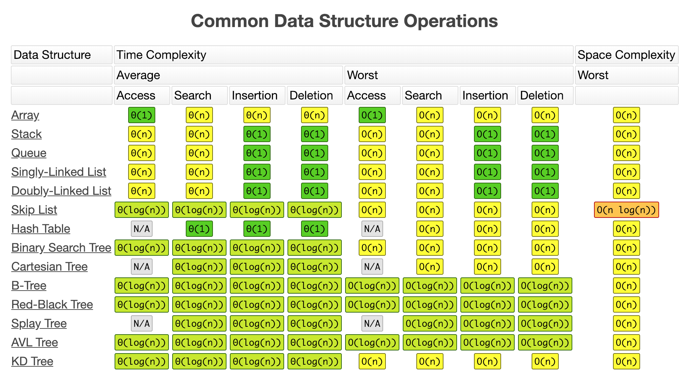

# 数据结构和算法
`程序` = `数据结构` + `算法`

## 练习题

1. [LeetCode project](LeetCode/README.md)中包含了 [LeetCode](https://leetcode-cn.com/) 上题目的解题思路和代码。
2. [剑指Offer project](剑指Offer/README.md) 中包含了 《剑指Offer》上题目的实现代码 in Swfit。

## 时间与空间复杂度

### 常见Big O复杂度比较


### 常见数据结构时间空间复杂度



### 常见排序时间空间复杂度


[Big O](http://www.bigocheatsheet.com/)

### 递归或查找算法的时间复杂度

[主定理(Master Theorem)](https://zh.wikipedia.org/wiki/主定理)：使用Big O表示许多由分治法得到的递推公式，根据公示得到Big O表示。


## 数据结构

### 1. 数组和链表

数组与链表不同操作造成的时间复杂度：

| 操作 | 数组 | 链表 |
| ---- | ---- | ---- |
| 查找 | O(1) | O(n) |
| 插入 | O(n) | O(1) |
| 删除 | O(n) | O(1) |

#### 数组

在内存中是一段连续的内存地址，可以通过下标偏移就可找到对应元素，所以时间负载度O(1)。但是在面对插入或者删除时，会造成其他元素移动来填满这段连续内存地址，所以时间复杂度是O(n)。

#### 链表

在内存中是分散的内存地址。查找很慢，插入删除很快。

##### 常见问题

###### 1. 链表中的环

1. 使用快慢指针，判断2个指针是否相遇。
2. 使用hash表存储访问过的节点，需要O(n)的额外空间。

> 《剑指offer》 面试题23 链表中的环入口节点
>
> 如果一个链表中包含环，如果找出环的入口节点？

###### 2. 两个单链表相交问题

1. 如何判断一个链表是否有环,如果有, 则返回第一个进入环的节点, 没有则返回null.
2. 如何判断两个无环链表是否相交, 相交则返回第一个相交节点, 不相交则返回null.
3. 如何判断两个有环链表是否相交, 相交则返回第一个相交节点, 不相交则返回null.

[两个单链表相交问题汇总](https://www.jianshu.com/p/7469401aa207)


### 2. Hash表

哈希表（Hash Table，也叫散列表），是根据关键码值 (Key-Value) 而直接进行访问的数据结构。也就是说，它通过把关键码值映射到表中一个位置来访问记录，以加快查找的速度。哈希表的实现主要需要解决两个问题，哈希函数和冲突解决。

#### 哈希函数

哈希表的关键思想是使用哈希函数`将键映射到存储桶`。更确切地说，

1. 当我们插入一个新的键时，哈希函数将决定该键应该分配到哪个桶中，并将该键存储在相应的桶中；
2. 当我们想要搜索一个键时，哈希表将使用相同的哈希函数来查找对应的桶，并只在特定的桶中进行搜索。

> 比如：对key的值进行hash后对数组长度%，这就是一个哈希函数。

#### 哈希碰撞 

在碰撞时有多种方式来解决冲突，开放定址法，链地址法，建立公共溢出区等。实际的哈希表实现中，使用最多的是链地址法：

> 链地址法：其实就是 `数组 + 链表` 的结构。


### 3. 队列

一种FIFO先进先出的数据结构。以数组作为底层数据结构的语言中，通常`队列`都是通过`循环数组`来实现。使用`循环数组`比普通`数组`更加高效、节约空间。  
[题目：使用循环数组实现队列]()  
[使用循环数组实现队列思路](https://leetcode-cn.com/explore/featured/card/queue-stack/216/queue-first-in-first-out-data-structure/865/)  

#### 广度优先搜索(BFS)

`广度优先搜索`（BFS）是一种`遍历或搜索`数据结构（如树或图）的算法。主要运用常见在`遍历`或`找出最短路径`。
[使用BFS查找最短路径]()

#### 深度优先(DFS)

`深度优先搜索`优先遍历节点深度。多用递归的方式，但是考虑到递归的局限性，通常也会考虑非递归的实现方式。

#### 剪枝

剪枝策略，属于算法优化范畴；通常应用在DFS 和 BFS 搜索算法中。剪枝策略就是寻找过滤条件，提前减少不必要的搜索路径。

### 4. 栈


### 5. 图

* BFS

* DFS

### 6. 树

树是图的一种特殊退化形式。

#### 树的遍历

1. 先序遍历
2. 中序遍历
3. 后序遍历
4. 分层遍历

##### 代码实现

```c
// 1. 先序遍历 递归
void pre_order_traversal(TreeNode *root) {
    // Do Something with root
    if (root->lchild != NULL)
        pre_order_traversal(root->lchild);
    if (root->rchild != NULL)
        pre_order_traversal(root->rchild);
}
```
```c
// 2. 中序遍历 递归
void in_order_traversal(TreeNode *root) {
    if (root->lchild != NULL)
        in_order_traversal(root->lchild);
    // Do Something with root
    if (root->rchild != NULL)
        in_order_traversal(root->rchild);
}
```
```c
// 3. 后序遍历 递归
void post_order_traversal(TreeNode *root) {
    if (root->lchild != NULL)
        post_order_traversal(root->lchild);
    if (root->rchild != NULL)
        post_order_traversal(root->rchild);
    // Do Something with root
}
```
```c++
// 前序遍历 非递归实现
// 1. 将根节点Node压入栈
// 2. 取出栈顶将其进行打印，同时将取得元素的左右孩子节点分别入栈
// 3. 直至栈中的元素全部取光
public void preOrderTraversal()
{
	Stack<BitNode> stack=new Stack<BitNode>();
	BitNode node;
	if(root!=null)
	{
		stack.push(root);
		while(stack.size()>0)
		{
			node=stack.pop();
			System.out.print(node.val+",");
			if(node.right!=null)
				stack.push(node.right);
			if(node.left!=null)
				stack.push(node.left);
		}
	}
}
```

```c++
// 中序遍历 
// 1. 首选将当前节点root的各个左子节点压入栈
// 2. 然后依次从栈中取数据，进行打印，将当前节点置为栈顶的右孩子节点，回到1
// 3. 直至栈为空
public void inOrderTraversal()
{
	Stack<BitNode> stack=new Stack<BitNode>();
	BitNode node=root;
	while(node!=null || stack.size()>0)
	{
		while(node!=null)
		{
			stack.push(node);
			node=node.left;
		}
		
		if(stack.size()>0)
		{
			node=stack.pop();
			System.out.print(node.val+",");
			node=node.right;
		}
	}
}
```

```c++
// 后序遍历 非递归实现
// 1. 首先将当前节点的各个孩子节点进行入数据栈，同时将该节点的值压入一个值栈
// 2. 然后依次从数据栈中取数据，将当前节点置为数据栈顶元素的左孩子节点，回到1
// 3. 直至数据栈为空，此时再依次遍历值栈进行打印即可
public void postOrderTraversal()
{
	Stack<BitNode> stack=new Stack<BitNode>();
	Stack<Integer> valStack=new Stack<Integer>();
	BitNode node=root;
	while(node!=null || stack.size()>0)
	{
		while(node!=null)
		{
			stack.push(node);
			valStack.push(node.val);
			node=node.right;
		}
		
		node=stack.pop();
		node=node.left;
	}
	
	while(valStack.size()>0)
	{
		System.out.print(valStack.pop()+",");
	}
}
```

每一种遍历都包含递归和非递归两种方式。递归的本质是栈，非递归算法其实就是递归换成栈结构实现，从上到下递归，从下到上的实现。

* 广度优先遍历，从上到下按层来遍历。
  队列实现

#### 完全二叉树

若设二叉树的深度为h，除第 h 层外，其它各层 (1～h-1) 的结点数都达到最大个数，第 h 层所有的结点都连续集中在最左边，这就是完全二叉树。

#### 平衡二叉树

平衡二叉树是基于二分法的策略提高数据的查找速度的二叉树的数据结构。

特征：

1. 非叶子节点最多拥有两个子节点；

2. 非叶子节值大于左边子节点、小于右边子节点；

3. 树的左右两边的层级数相差不会大于1;

4. 没有值相等重复的节点;

#### B树

B树和平衡二叉树稍有不同的是B树属于**多叉树**又名平衡多路查找树（查找路径不只两个），**数据库索引**技术里大量使用者B树和B+树的数据结构，让我们来看看他有什么特点。

#### B+树

[B+树]([https://zh.wikipedia.org/wiki/B%2B%E6%A0%91](https://zh.wikipedia.org/wiki/B%2B树))是一种[树数据结构](https://zh.wikipedia.org/wiki/树_(数据结构))，通常用于[数据库](https://zh.wikipedia.org/wiki/数据库)和[操作系统](https://zh.wikipedia.org/wiki/操作系统)的[文件系统](https://zh.wikipedia.org/wiki/文件系统)中。B+ 树的特点是能够保持数据稳定有序，其插入与修改拥有较稳定的对数时间复杂度。B+ 树元素自底向上插入，这与[二叉树](https://zh.wikipedia.org/wiki/二叉树)恰好相反。

#### 红黑树

#### Huffman树

给定nn权值作为nn个叶子节点，构造一棵二叉树，若这棵二叉树的带权路径长度达到最小，则称这样的二叉树为最优二叉树，也称为Huffman树。

##### Huffman编码

有了上述的Huffman树的结构，现在我们需要利用Huffman树对每一个字符编码，该编码又称为Huffman编码，Huffman编码是一种前缀编码，即一个字符的编码是另一个字符编码的前缀。在这里约定：

* 将权值小的最为左节点，权值大的作为右节点

* 左孩子编码为0，右孩子编码为1

##### 字典树

字典树（Trie）是一种很特别的树状信息检索数据结构，如同其名，它的构成就像一本字典，可以让你快速的进行字符插入、字符串搜索等。

**字典树的性质**

1. 根节点（Root）不包含字符，除根节点外的每一个节点都仅包含一个字符；
2. 从根节点到某一节点路径上所经过的字符连接起来，即为该节点对应的字符串；
3. 任意节点的所有子节点所包含的字符都不相同；

// TODO

> https://www.cnblogs.com/gaochundong/p/trie_tree.html

### 7. 堆

[堆](<https://en.wikipedia.org/wiki/Heap_(data_structure)>) 是一种用数组实现二叉树的数据结构，满足以下特性就可以称为堆：

* 使用数组实现。

* 父节点的值>=子节点的值就是**最大堆**，父节点的值<=子节点的值就是**最小堆**。
* 堆总是一棵[完全树](https://zh.wikipedia.org/wiki/%E5%AE%8C%E5%85%A8%E4%BA%8C%E5%8F%89%E6%A0%91)。即除了最底层，其他层的节点都被元素填满，且最底层尽可能地从左到右填入。

| 操作    | 描述                         | [时间复杂度](https://zh.wikipedia.org/wiki/%E6%97%B6%E9%97%B4%E5%A4%8D%E6%9D%82%E5%BA%A6) |
| ------- | ---------------------------- | ------------------------------------------------------------ |
| build   | 创建一个空堆                 | n                                                            |
| insert  | 向堆中插入一个新元素         | O(logn)                                                      |
| get     | 获取当前堆顶元素的值         | O(1)                                                         |
| delete  | 删除堆顶元素                 | O(logn)                                                      |

#### 数组表示堆

```swift
parent(i) = floor((i - 1)/2)
left(i)   = 2i + 1
right(i)  = 2i + 2
```

#### 插入

1. 新插入的结点添加到数组最后
2. 和其父结点比较大小，如果大于父结点，就用父结点替换当前位置，同时自己的位置上移。
3. 直到父结点不再大于自己或者是位置已近到了数组第一个位置，就找到属于自己的位置了。

#### 删除

1. 找到要删除的结点在数组中的位置
2. 用数组中最后一个元素替代这个位置的元素
3. 当前位置和其左右子树比较，保证符合最大堆的结点间规则
4. 删除最后一个元素

#### 堆的变体


> 常用的还是 Fibonacci堆 和 Strict Fibonacci堆，性能是最好的。

#### 常见问题

* 堆排序。
* 海量数据的 **Top K** 问题。

#### 堆的运用

1. 优先队列：使用最小堆或最大堆实现。

   


## 算法

### 0. 查找

#### 二分查找

基础非递归实现：

```java
int binarySearch(int[] nums, int target){
  if(nums == null || nums.length == 0)
    return -1;

  int left = 0, right = nums.length - 1;
  while(left <= right){
    // Prevent (left + right) overflow
    int mid = left + (right - left) / 2;
    if(nums[mid] == target){ return mid; }
    else if(nums[mid] < target) { left = mid + 1; }
    else { right = mid - 1; }
  }

  // End Condition: left > right
  return -1;
}	
```

递归实现：

```swift
func search(_ nums: [Int]?, _ target: Int) -> Int {
        
        guard let nums = nums else {
            return -1
        }
        
        if nums.count == 0 || target < nums.first! || target > nums.last! {
            return -1
        }
        
        return binarySearch(nums, start: 0, end: nums.count-1, target: target)
    }
    
    func binarySearch(_ nums: [Int], start: Int, end: Int, target: Int) -> Int {
        let mid = (start + end)/2
        
        if target > nums[mid] {
            return binarySearch(nums, start: mid+1, end: end, target: target)
        } else if target < nums[mid] {
            return binarySearch(nums, start: 0, end:mid-1, target: target)
        } else {
            return mid
        }
    }
```


### 1. 指针（双指针技巧）

#### 从两端向中间迭代

**同时使用两个指针**进行迭代，使用双指针技巧的典型场景之一是你想要**从两端向中间迭代**数组。这时你可以使用双指针技巧：**一个指针从始端开始，而另一个指针从末端开始**。值得注意的是，这种技巧经常在**排序数组**中使用。

常见场景：

1. 反转数组中的元素  
2. 快速排序变种算法
3. 数据排序  

[344. 反转字符串](#344-反转字符串)  

#### 快慢指针

> 经典题目：给定一个数组和一个值，原地删除该值的所有实例并返回新的长度。考虑空间限制，不重新创建空间。  
> 解决方案：我们使用两个指针：一个仍然用于迭代，而第二个指针总是指向下一次添加删除元素的位置。 

```swift
func removeElement(nums: [Int], val: Int) {
    let k = 0
    for i in 0..<nums.count {
        if nums[i] != val {
            nums[k] = nums[i]
            k += 1
        }
    }
    return k
}
```

[167. 两数之和 II - 输入有序数组](#167-两数之和-ii-输入有序数组)   

#### 滑窗指针

**使用两个指针一前一后遍历**，根据前后指针不同位置，指针闭区间内可以覆盖所有连续组合。  
[209. 长度最小的子数组](209-长度最小的子数组) 

### 2. 排序

好的排序排序算法时间复杂度应该是nlogn，以下是常见的7中排序：

| 名称 | 时间复杂度 | 空间复杂度 | 是否稳定 |
| --- | --- | --- | --- |
| 冒泡排序 | O(n^2) | O(1) | 是 |
| 插入排序 | O(n^2) | O(1) | 是 |
| 选择排序 | O(n^2) | O(1) | 否 |
| 堆排序 | O(nlogn) | O(1) | 否 |
| 归并排序 | O(nlogn) | O(n) | 是 |
| 快速排序 | O(nlogn) | O(logn) | 否 |
| 桶排序 | O(n) | O(k) | 是 |

#### 1. 冒泡排序

常规写法：

```swift
func BubbleSort(array: Array) -> Array {
	for i in 0..<array.count {
  		for j in 1..<array.count - i {
    		if array[j] < array[j-1] {
      			let tmp = array[j-1]
				array[j-1] = array[j]
      			array[j] = tmp
    		}
  		}
	}
    
	return array
}
```


优化:如果已经是有序了就退出循环，判读是否已经有序只用判断是否发生交换。

```swift
func BubbleSort(array: Array) -> Array {
	for i in 0..<array.count {
		var swapped = false
  		for j in 1..<array.count - i {
    		if array[j] < array[j-1] {
      			let tmp = array[j-1]
				array[j-1] = array[j]
      			array[j] = tmp
      			
      			swapped = true
    		}
  		}
  		
  		// 已经是有序了，不在遍历后面
  		if swapped == false {
            break;
  		}
	}
    
	return array
}
```


[鸡尾酒排序](https://zh.wikipedia.org/wiki/%E9%B8%A1%E5%B0%BE%E9%85%92%E6%8E%92%E5%BA%8F)：

```swift
func cocktailSort(array: Array) {
    var left:Int = 0
    var right:Int = arr.count - 1
    var index:Int = 0
    
    while left < right {
        for  i in left..<right {
            if array[i] > array[i + 1] {
                swap(&array[i], &array[i + 1])
                index = i
            }
        }
        
        right = index
        let temp = left + 1
        if temp < right {
            for i in (temp...right).reversed() {
                if array[i] < array[i-1] {
                    swap(&array[i], &array[i-1])
                    index = i
                }
            }
            left = index
        }
    }
}
```

####  2. 插入排序

一般来说，[**插入排序**](https://zh.wikipedia.org/wiki/%E6%8F%92%E5%85%A5%E6%8E%92%E5%BA%8F)都采用in-place在数组上实现。具体算法描述如下：

1. 从第一个元素开始，该元素可以认为已经被排序
2. 取出下一个元素，在已经排序的元素序列中从后向前扫描
3. 如果该元素（已排序）大于新元素，将该元素移到下一位置
4. 重复步骤3，直到找到已排序的元素小于或者等于新元素的位置
5. 将新元素插入到该位置后
6. 重复步骤2~5

```java
public void insertionSort(int[] array) {
		for (int i = 1; i < array.length; i++) {
			int key = array[i];
			int j = i - 1;
			while (j >= 0 && array[j] > key) {
				array[j + 1] = array[j];
				j--;
			}
			array[j + 1] = key;
		}
	}
```


**二分查找插入排序**

>  如果*比较操作*的代价比*交换操作*大的话，可以采用[二分查找法](https://zh.wikipedia.org/wiki/%E4%BA%8C%E5%88%86%E6%9F%A5%E6%89%BE%E6%B3%95)来减少*比较操作*的数目。该算法可以认为是**插入排序**的一个变种

是直接插入排序的一个变种，区别是：在有序区中查找新元素插入位置时，为了减少元素比较次数提高效率，采用二分查找算法进行插入位置的确定。

**希尔排序**

**希尔排序**，也称**递减增量排序算法**，是[插入排序](https://zh.wikipedia.org/wiki/%E6%8F%92%E5%85%A5%E6%8E%92%E5%BA%8F)的一种更高效的改进版本。希尔排序是非稳定排序算法。

希尔排序是基于插入排序的以下两点性质而提出改进方法的：

- 插入排序在对几乎已经排好序的数据操作时，效率高，即可以达到[线性排序](https://zh.wikipedia.org/w/index.php?title=%E7%BA%BF%E6%80%A7%E6%8E%92%E5%BA%8F&action=edit&redlink=1)的效率
- 但插入排序一般来说是低效的，因为插入排序每次只能将数据移动一位


#### 3. 选择排序

[**选择排序**（Selection sort）](https://zh.wikipedia.org/wiki/%E9%80%89%E6%8B%A9%E6%8E%92%E5%BA%8F)是一种简单直观的[排序算法](https://zh.wikipedia.org/wiki/%E6%8E%92%E5%BA%8F%E7%AE%97%E6%B3%95)。它的工作原理如下。首先在未排序序列中找到最小（大）元素，存放到排序序列的起始位置，然后，再从剩余未排序元素中继续寻找最小（大）元素，然后放到已排序序列的末尾。以此类推，直到所有元素均排序完毕。

优缺点：

1. 原地操作几乎是选择排序的唯一优点，当空间复杂度要求较高时，可以考虑选择排序；

2. 实际适用的场合非常罕见。

```swift
/// - Parameter list: 需要排序的数组
func selectionSort(_ list: inout [Int]) -> Void {
    for j in 0..<list.count - 1 {
        var minIndex = j
        for i in j..<list.count {
            if list[minIndex] > list[i] {
                minIndex = i
            }
        }
        list.swapAt(j, minIndex)
    }
}
```


#### 4. 堆排序

**堆排序**（英语：Heapsort）是指利用[堆](https://zh.wikipedia.org/wiki/%E5%A0%86_(%E6%95%B0%E6%8D%AE%E7%BB%93%E6%9E%84))这种数据结构所设计的一种[排序算法](https://zh.wikipedia.org/wiki/%E6%8E%92%E5%BA%8F%E7%AE%97%E6%B3%95)。堆是一个近似**完全二叉树**的结构，并同时满足**堆积的性质**：即子节点的键值或索引总是小于（或者大于）它的父节点。

```java
public class HeapSort {
    private int[] arr;
    public HeapSort(int[] arr) {
        this.arr = arr;
    }

    /**
     * 堆排序的主要入口方法，共两步。
     */
    public void sort() {
        /*
         *  第一步：将数组堆化
         *  beginIndex = 第一个非叶子节点。
         *  从第一个非叶子节点开始即可。无需从最后一个叶子节点开始。
         *  叶子节点可以看作已符合堆要求的节点，根节点就是它自己且自己以下值为最大。
         */
        int len = arr.length - 1;
        int beginIndex = (len - 1) >> 1;
        for (int i = beginIndex; i >= 0; i--)
            maxHeapify(i, len);
        /*
         * 第二步：对堆化数据排序
         * 每次都是移出最顶层的根节点A[0]，与最尾部节点位置调换，同时遍历长度 - 1。
         * 然后从新整理被换到根节点的末尾元素，使其符合堆的特性。
         * 直至未排序的堆长度为 0。
         */
        for (int i = len; i > 0; i--) {
            swap(0, i);
            maxHeapify(0, i - 1);
        }
    }

    private void swap(int i, int j) {
        int temp = arr[i];
        arr[i] = arr[j];
        arr[j] = temp;
    }

    /**
     * 调整索引为 index 处的数据，使其符合堆的特性。
     *
     * @param index 需要堆化处理的数据的索引
     * @param len 未排序的堆（数组）的长度
     */
    private void maxHeapify(int index, int len) {
        int li = (index << 1) + 1; // 左子节点索引
        int ri = li + 1;           // 右子节点索引
        int cMax = li;             // 子节点值最大索引，默认左子节点。
        if (li > len) return;      // 左子节点索引超出计算范围，直接返回。
        if (ri <= len && arr[ri] > arr[li]) // 先判断左右子节点，哪个较大。
            cMax = ri;
        if (arr[cMax] > arr[index]) {
            swap(cMax, index);      // 如果父节点被子节点调换，
            maxHeapify(cMax, len);  // 则需要继续判断换下后的父节点是否符合堆的特性。
        }
    }

    /**
     * 测试用例
     *
     * 输出：
     * [0, 0, 0, 1, 1, 1, 2, 2, 2, 3, 3, 3, 4, 4, 4, 5, 5, 5, 6, 6, 6, 7, 7, 7, 8, 8, 8, 9, 9, 9]
     */
    public static void main(String[] args) {
        int[] arr = new int[] {3, 5, 3, 0, 8, 6, 1, 5, 8, 6, 2, 4, 9, 4, 7, 0, 1, 8, 9, 7, 3, 1, 2, 5, 9, 7, 4, 0, 2, 6};
        new HeapSort(arr).sort();
        System.out.println(Arrays.toString(arr));
    }
}
```

#### 5. 归并排序

**归并排序**（英语：Merge sort，或mergesort），是创建在归并操作上的一种有效的[排序算法](https://zh.wikipedia.org/wiki/%E6%8E%92%E5%BA%8F%E7%AE%97%E6%B3%95)，[效率](https://zh.wikipedia.org/wiki/%E6%97%B6%E9%97%B4%E5%A4%8D%E6%9D%82%E5%BA%A6)为nlogn。1945年由[约翰·冯·诺伊曼](https://zh.wikipedia.org/wiki/%E7%BA%A6%E7%BF%B0%C2%B7%E5%86%AF%C2%B7%E8%AF%BA%E4%BC%8A%E6%9B%BC)首次提出。该算法是采用[分治法](https://zh.wikipedia.org/wiki/%E5%88%86%E6%B2%BB%E6%B3%95)（Divide and Conquer）的一个非常典型的应用，且各层分治递归可以同时进行。

**时间复杂度**：初始数组是否已经排序不会影响合并排序算法的速度，因为无论元素的初始顺序如何，您都将进行相同数量的拆分和比较。所以这是一个稳定的算法：最坏、最好、平均时间复杂度都是 **O(nlogn)**。

**缺点**：是它需要一个临时的“工作”数组，其大小与被排序的数组相同空间复杂度**O(n)**。 它不是就地排序，不像快速排序。

> 合并排序算法的大多数实现产生稳定的排序。 这意味着具有相同排序键的数组元素在排序后将保持相对于彼此的相同顺序。 这对于数字或字符串等简单值并不重要，但在排序更复杂的对象时可能会出现问题。


```swift
// 递归版本
func mergeSort(_ array: [Int]) -> [Int] {
  guard array.count > 1 else { return array }    

  let middleIndex = array.count 

  let leftArray = mergeSort(Array(array[0..<middleIndex]))             
  let rightArray = mergeSort(Array(array[middleIndex..<array.count]))  

  return merge(leftPile: leftArray, rightPile: rightArray)             
}

func merge(leftPile: [Int], rightPile: [Int]) -> [Int] {
  var leftIndex = 0
  var rightIndex = 0

  var orderedPile = [Int]()

  while leftIndex < leftPile.count && rightIndex < rightPile.count {
    if leftPile[leftIndex] < rightPile[rightIndex] {
      orderedPile.append(leftPile[leftIndex])
      leftIndex += 1
    } else if leftPile[leftIndex] > rightPile[rightIndex] {
      orderedPile.append(rightPile[rightIndex])
      rightIndex += 1
    } else {
      orderedPile.append(leftPile[leftIndex])
      leftIndex += 1
      orderedPile.append(rightPile[rightIndex])
      rightIndex += 1
    }
  }

  while leftIndex < leftPile.count {
    orderedPile.append(leftPile[leftIndex])
    leftIndex += 1
  }

  while rightIndex < rightPile.count {
    orderedPile.append(rightPile[rightIndex])
    rightIndex += 1
  }

  return orderedPile
}

// 非递归版本
func mergeSortBottomUp<T>(_ a: [T], _ isOrderedBefore: (T, T) -> Bool) -> [T] {
  let n = a.count

  var z = [a, a]      // 1
  var d = 0

  var width = 1
  while width < n {   // 2

    var i = 0
    while i < n {     // 3

      var j = i
      var l = i
      var r = i + width

      let lmax = min(l + width, n)
      let rmax = min(r + width, n)

      while l < lmax && r < rmax {                // 4
        if isOrderedBefore(z[d][l], z[d][r]) {
          z[1 - d][j] = z[d][l]
          l += 1
        } else {
          z[1 - d][j] = z[d][r]
          r += 1
        }
        j += 1
      }
      while l < lmax {
        z[1 - d][j] = z[d][l]
        j += 1
        l += 1
      }
      while r < rmax {
        z[1 - d][j] = z[d][r]
        j += 1
        r += 1
      }

      i += width*2
    }

    width *= 2
    d = 1 - d      // 5
  }
  return z[d]
}
```


#### 6. 快速排序

**快速排序**（英语：Quicksort），又称**划分交换排序**（partition-exchange sort），简称**快排**，一种[排序算法](https://zh.wikipedia.org/wiki/%E6%8E%92%E5%BA%8F%E7%AE%97%E6%B3%95)，最早由[东尼·霍尔](https://zh.wikipedia.org/wiki/%E6%9D%B1%E5%B0%BC%C2%B7%E9%9C%8D%E7%88%BE)提出。在平均状况下，排序**n**个项目要**O(nlogn)**（[大O符号](https://zh.wikipedia.org/wiki/%E5%A4%A7O%E7%AC%A6%E5%8F%B7)）次比较。在最坏状况下则需要**O(n^2)**次比较，但这种状况并不常见。事实上，快速排序**O(nlogn)**通常明显比其他算法更快，因为它的内部循环（inner loop）可以在大部分的架构上很有效率地达成。

| 最坏时间复杂度 | O(n^2)                   |
| -------------- | ------------------------ |
| 最优时间复杂度 | **O(nlogn)**             |
| 平均时间复杂度 | **O(nlogn)**             |
| 最坏空间复杂度 | 根据实现的方式不同而不同 |

最简单的实现：

```swift
func quicksort<T: Comparable>(_ a: [T]) -> [T] {
  guard a.count > 1 else { return a }

  let pivot = a[a.count/2]
  let less = a.filter { $0 < pivot }
  let equal = a.filter { $0 == pivot }
  let greater = a.filter { $0 > pivot }

  return quicksort(less) + equal + quicksort(greater)
}
```

效率比较低

##### Lomuto's partitioning scheme

```swift
func partitionLomuto<T: Comparable>(_ a: inout [T], low: Int, high: Int) -> Int {
  let pivot = a[high]

  var i = low
  for j in low..<high {
    if a[j] <= pivot {
      (a[i], a[j]) = (a[j], a[i])
      i += 1
    }
  }

  (a[i], a[high]) = (a[high], a[i])
  return i
}

func quicksortLomuto<T: Comparable>(_ a: inout [T], low: Int, high: Int) {
  if low < high {
    let p = partitionLomuto(&a, low: low, high: high)
    quicksortLomuto(&a, low: low, high: p - 1)
    quicksortLomuto(&a, low: p + 1, high: high)
  }
}
```

##### Hoare's partitioning scheme

```swift
func partitionHoare<T: Comparable>(_ a: inout [T], low: Int, high: Int) -> Int {
  let pivot = a[low]
  var i = low - 1
  var j = high + 1

  while true {
    repeat { j -= 1 } while a[j] > pivot
    repeat { i += 1 } while a[i] < pivot

    if i < j {
      a.swapAt(i, j)
    } else {
      return j
    }
  }
}

func quicksortHoare<T: Comparable>(_ a: inout [T], low: Int, high: Int) {
  if low < high {
    let p = partitionHoare(&a, low: low, high: high)
    quicksortHoare(&a, low: low, high: p)
    quicksortHoare(&a, low: p + 1, high: high)
  }
}
```

##### 优化 pivot 选取问题 

**1. 对于近乎有序的数租如何排序？**

比如 `[ 7, 6, 5, 4, 3, 2, 1 ]`，在使用Lomuto方法时，每次使用的pivot都是最后一个元素。split后的数组极其不平衡。时间复杂度是O(n^2)。

**利用随机pivot的方式**

```swift
func quicksortRandom<T: Comparable>(_ a: inout [T], low: Int, high: Int) {
  if low < high {
    let pivotIndex = random(min: low, max: high)         // 1

    (a[pivotIndex], a[high]) = (a[high], a[pivotIndex])  // 2

    let p = partitionLomuto(&a, low: low, high: high)
    quicksortRandom(&a, low: low, high: p - 1)
    quicksortRandom(&a, low: p + 1, high: high)
  }
}
```

**2. 对于有大量重复元素如何优化？**

利用三个指针划分三个区域，大量重复元素会集中在相等的区域。而我们则对小于和大于pivot的区域继续排序。这样能避开对大量重复元素的反复排序。

```swift
// 划分三个区域
[ values < pivot | values equal to pivot | values > pivot ]
```

```swift
// 快速排序最优方案
func partitionDutchFlag<T: Comparable>(_ a: inout [T], low: Int, high: Int, pivotIndex: Int) -> (Int, Int) {
  let pivot = a[pivotIndex]

  var smaller = low
  var equal = low
  var larger = high

  while equal <= larger {
    if a[equal] < pivot {
      swap(&a, smaller, equal)
      smaller += 1
      equal += 1
    } else if a[equal] == pivot {
      equal += 1
    } else {
      swap(&a, equal, larger)
      larger -= 1
    }
  }
  return (smaller, larger)
}

func quicksortDutchFlag<T: Comparable>(_ a: inout [T], low: Int, high: Int) {
  if low < high {
    let pivotIndex = random(min: low, max: high)
    let (p, q) = partitionDutchFlag(&a, low: low, high: high, pivotIndex: pivotIndex)
    quicksortDutchFlag(&a, low: low, high: p - 1)
    quicksortDutchFlag(&a, low: q + 1, high: high)
  }
}
```


#### 7. 桶排序

### 3. 斐波那契数列

$$

$$


### 4. 回溯法（递归）

回溯法可以看成是蛮力法的升级版，它从解决问题每一步的所有可能选项里系统地选择出一个可行的解决方案。回溯法非常适合由多个步骤组成的问题，并且每个步骤都有多个选项。当我们再某一步选择了其中一个选项时，就进入下一步，然后又面临新的选择。我们就这样重复选择，知道达到最终的状态。

相关题目有：

* 矩阵中的路径
* 机器人的运动范围

解决方案： 

* 递归

> 递归本质是栈，也可以用栈的结构替换递归方案。

* 创建visited数组，保存访问过的节点。


### 5. 动态规划与贪婪算法

#### 动态规划

使用条件：

1. 求一个问题的最优解。
2. 整体问题的最优解是依赖各个子问题的最优解。
3. 我们把大问题分解成若干个小问题，这些小问题之间还有相互重叠的更小的子问题。
4. 从上往下分析问题，从下往上求解问题。


#### 贪婪算法

贪婪算法和动态规划不一样。当我们应用贪婪算法解决问题的时候，每一步都可以做出一个贪婪的选择，基于这个选择，我们确定能够得到最优解。


面试题14：剪绳子


### 6. 位运算

| 与 &    | 0 & 0 = 0               | 1 & 0 = 0               | 0 & 1 = 0                | 1 & 1 = 1 |
| ------- | ----------------------- | ----------------------- | ------------------------ | --------- |
| 或 \|   | 0 \| 0 = 0              | 1 \| 0 = 1              | 0 \| 1 = 1               | 1\| 1 = 1 |
| 异或 ^  | 0 ^ 0 = 0               | 1 ^ 0 = 1               | 0 ^ 1 = 1                | 1 ^ 1 = 0 |
| 左移 << | 0010 << 1 = 0100 无符号 | 1000 << 1 = 0000 无符号 | 有符号最左边的符号位不变 |           |
| 右移 >> | 0010 >> 1 = 0001 无符号 | 0001 >> 1 = 0000 无符号 |                          |           |

#### (n-1) & n 最右边的1会变成0。n是一个二进制数

把一个整数减1，再和原整数做与运算，会把整数最右边的1变成0。那么一个整数中的二进制表示中有多少个1，就可以进行多少次这样的操作。

```c
// 计算整数n的二进制表达式中有多少个1.
int NumberOf1(int n) {
    int count = 0;
    while (n) {
        ++ count;
        n = (n-1)&n;
    }
    
    return count;
}
```


## 测试用例

测试用例应该包括三个方面：

1. 功能测试
2. 边界值测试
3. 特殊输入/无效输入测试